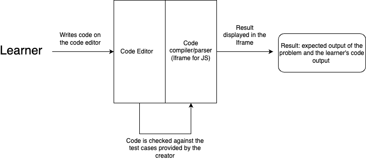

# Developer Document - Virtual Labs Code Assessment Tool

## Overview

The Virtual Labs Code Assessment Tool is designed to provide experiment developers with an efficient way to integrate code assessment exercises into their experiments and for learners to try these coding exercies to enrich their learning experience. This document server as the guide for developers working on this repository.
## Table of Contents

- [Design Decisions](#design-decisions)
- [Project Setup](#project-setup)
- [Directory Structure](#directory-structure)
- [Serving Static Files](#serving-static-files)
- [Coding Conventions](#coding-conventions)
- [Development Workflows](#development-workflows)
- [Future Updates and Features](#future-updates-and-features)


## Design Decisions
The tool has been developed given that the aim is to remain `serverless` for not imparting extra load to the system while being able to serve the necessary features effectively. Major design choices which are adapted are:
- Only support **Javascript** since it can be interpreted by the browser directly without any external service required. We use Iframes for interpreting the JS code submitted by the learners
- Alignment of the solution's algorithm/logic with the problem is not provided given that will required processing of the submitted code on the backend side, possibly with the help of AI tools and APIs

The following user-flow diagram gives a brief workflow of the tool:


- The tool has been designed keeping in mind both the code-editor and the iframe displaying the result. Both these divs are contained in a flex-parent making the tool adaptive to all screen sizes and displays
- Code editor has been setup using an open-source npm package. It provides support for code syntax and highlighting.
- The results are displayed and parsed in an iframe, making the tool serverless and thus highly efficient ( but with JS support only ). 
- To allow multi-problem support, a navigation bar with the problem names have been added at the top of the tool.


## Project Setup

- Clone the Virtual Labs Code Assessment Tool repository from the [GitHub repository](https://github.com/virtual-labs/comp-code-editor) to your local development environment.
- Set up your development environment according to your preferred IDE and tools.

## Directory Structure

The directory structure of the Virtual Labs Code Assessment Tool project is as follows:

```
.github
public/
    code-assessment.json
    index.html
src/
    components/
        Editor/
        WebEditor/
    App.css
    App.js
    index.css
    index.js
package-lock.json
package.json
```
The component is build as a `create-react-app` project. Thus the project structure follows a division. All the component files are self-explainatory and contain codes for individual components.

The directory structure provides a logical organization of the project's files and modules. Each directory contains files specific to its corresponding module or functionality. The following subdirectories in the `components` folder containes individual modules:
- `Editor`: The code editor component build using the *codemirror* npm package
- `WebEditor`: The code for parsing the code-assessment.json and building the problems, code templates and the result Iframe.
## Serving Static Files

The tool is build using `npm run build` command and the final static js and css files are deployed and served through the `gh-pages` branch of this repository. The main branch contains the code for the react component and compiled statis files are used for Integration with the experiments

Scripts for automatic build and deployement to gh-pages are provided in the `.github/worklfows` folder.


## Coding Conventions

- Follow the established coding conventions and best practices to maintain consistency and readability in the codebase.
- Document your code using appropriate comments and inline documentation to enhance code understandability.

## Development Workflows

Any commit to `main` branch of this repository will push the build static files to the `gh-pages` branch follwing the workflows file `build-script.yml`

## Future Updates and Features
Outlined here are the forthcoming releases, each presenting a progression of enhancements and new features designed to elevate the overall user experience

- Providing support for multiple languages while enabling the system to remain serverless. Current system used iframes to interpret JS only codes. Future work can be built upon utilising web-assembly with its expanding support of other languages as well including python, rust, C, etc
- Integrating popular LLMs for problem specific code understanding and more detailed evaluation of the code submitted thus enhancing the tool much further. The integration can be done using **client-side parsing of results from APIs of these LLMs** thus maintaining the tool serverless.
---
